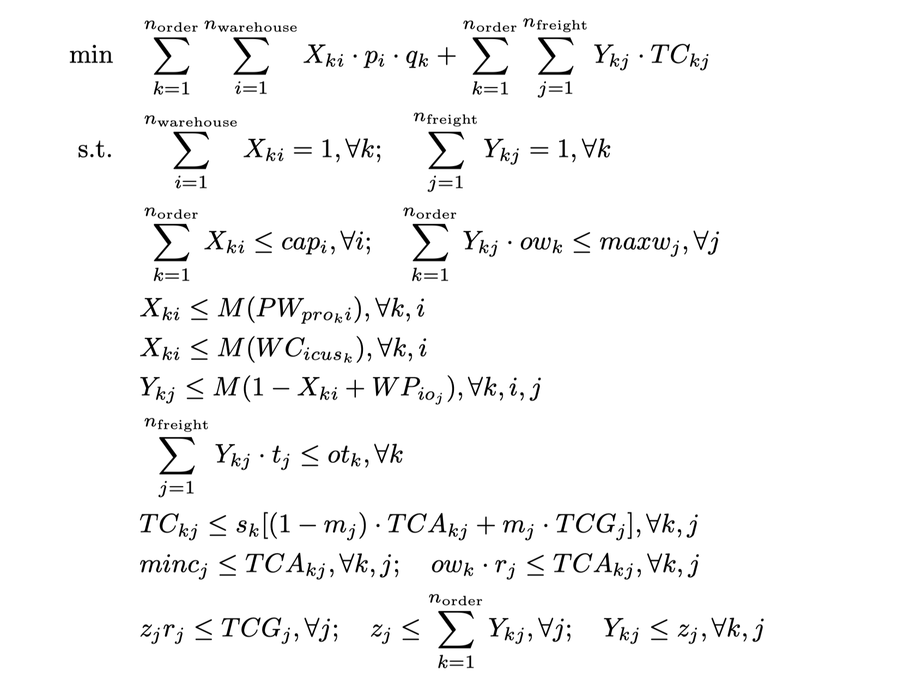

# Supply Chain Route Optimization
Final Project - 15.093/6.7201 Optimization Methods @MIT

Project Member: [Zeki Yan](www.linkedin.com/in/zikaiyan), [Vincent Tian](https://www.linkedin.com/in/vincentian/)

## Table of Contents

- [Introduction](#Introduction)
- [Data](#Data)
- [Exploratory Data Analysis](#Exploratory-Data-Analysis)
- [Baseline Model](#Baseline-Model)
- [Optimization Model](#Optimization-Model)
- [Results and Analysis](#results-and-analysis)
- [Business Insights](#Business-Insights)
- [References](#References)

## Introduction

Tatiana Kalganova and Ivars Dzalbs published a dataset of logistics networks. This dataset includes demand information for 1000 orders, which must be directed through their distribution system, consisting of 19 warehouses, 11 ports of departure, and a single port of arrival.

The project is to design an optimal distribution network that incorporates warehouses, shipping routes, and courier services to create the most economical supply chain possible. The goal is to minimize the total costs, comprising warehouse operations and transportation expenses, while adhering to the constraints of demand, supply, and shipping logistics.

## Data

The data for this project is from Brunel University London’s public supply chain datasets.

- [Supply Chain Logistics Problem Dataset](https://brunel.figshare.com/articles/dataset/Supply_Chain_Logistics_Problem_Dataset/7558679)
- Detailed descriptions of this dataset can be found in the paper: *[Accelerating supply chains with Ant Colony Optimization across a range of hardware solutions](https://www.sciencedirect.com/science/article/pii/S0360835220303442?via%3Dihub)*

## Exploratory Data Analysis

Most warehouses are connected to only a single warehouse port, and many warehouses are connected to warehouse port 4. This suggests that many warehouses may only be sent via one freight, and many orders may be sent through freight going through warehouse port 4.

Most products are only ordered a small number of times.

Most warehouses negatively correlate the cost per unit cost and the daily order capacity. We should expect the warehouses with lower costs per unit to have the most orders allocated.

## Baseline Model

We developed a baseline model for addressing this problem, the **Yan-Tian Greedy Algorithm**. The primary concept behind this approach involves a systematic iteration through all incoming orders. For each order, we search available warehouses and their corresponding freight options, starting from the beginning of the list. The algorithm then assigns the order to the first suitable warehouse-freight pair it encounters, following a thorough evaluation to ensure that all necessary conditions are met before making the assignment. The pseudo-code is shown as follows.

The cost of the solution produced by the baseline model is **\$8,878,241.89**.

## Optimization Model

## Results and Analysis

The figure shows the optimal warehouse and freight allocation for each of the 1000 orders. Note that freight allocation is composed of a warehouse port and carrier.

Total cost reduction:

- The optimal cost of our solution is **\$5,365,566.57**.
- The cost of the solution produced by the baseline model is **\$8,878,241.89**.
- Our solution reduced the total cost by **\$3,512,675.32**, which is a **39.5%** reduction in cost.

## Business Insights

The solution produced by our model surpasses the previously provided solution by the freight company.

- We reduced the total cost, including storage and transportation costs, by **39.5%**.

The outcomes obtained in our study align with the expectations derived from our preliminary exploratory analysis.

- Many orders to pass through warehouse port 4.
- Due to their lower daily cost per unit, many orders were allocated to Warehouse three and 11.
- Few orders are allocated to warehouses 15, 16, or 18 due to their high daily cost.

## References

1. [Brunel University London. (2019). Supply Chain Logistics Problem Dataset. Brunel University London](https://brunel.figshare.com/articles/dataset/Supply_Chain_Logistics_Problem_Dataset/7558679).
2. [Dzalbs I, Kalganova T. (2020). Accelerating supply chains with Ant Colony Optimization across a range of hardware solutions. *ScienceDirect*](https://www.sciencedirect.com/science/article/pii/S0360835220303442?via%3Dihub).
3. [Brechter, L. (n.d.). Supply Chain Data. Kaggle](https://www.kaggle.com/datasets/laurinbrechter/supply-chain-data).
4. Bertsimas, D. \& Tsitsiklis, J. (1997), Introduction to linear optimization , Athena Scientific .
5. [Sankey Diagrams in Python](https://medium.com/@cbkwgl/sankey-diagrams-in-python-fc9673465ccb).
